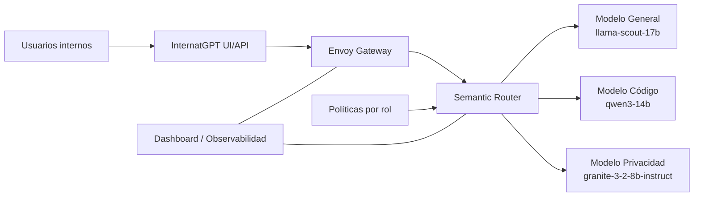
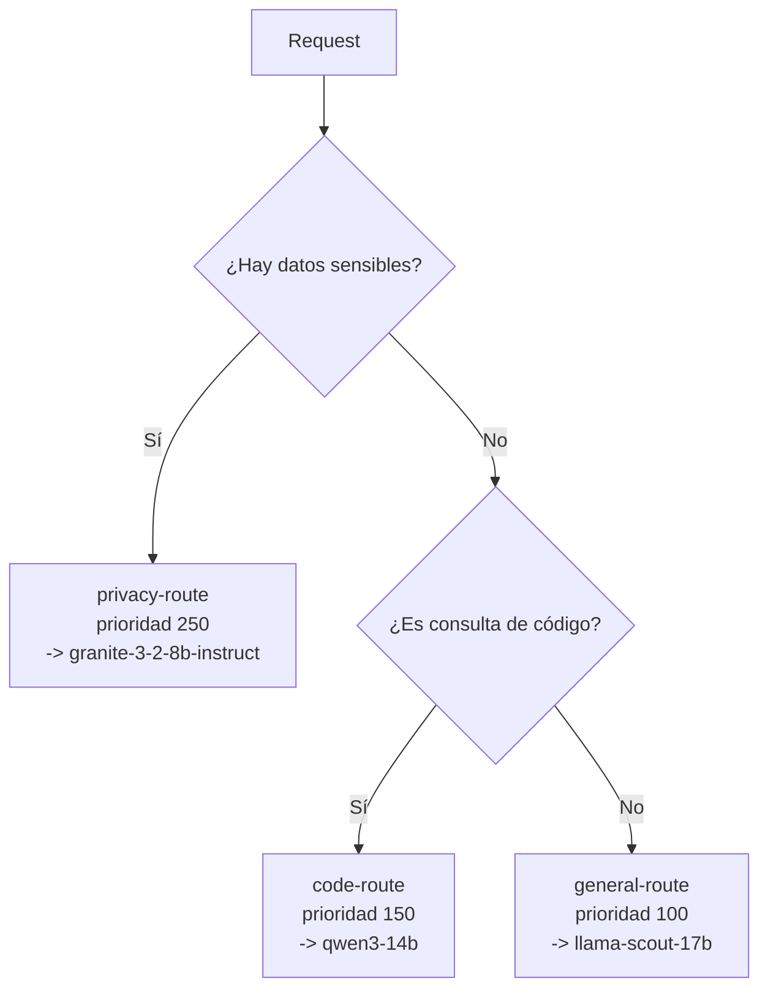
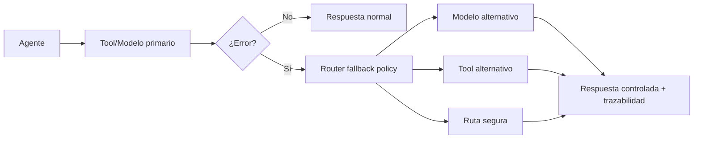

# Arquitectura autoexplicada — InternatGPT + Semantic Router

Este documento describe la arquitectura de la demo de forma autosuficiente: componentes, flujo de datos, reglas de routing y manejo de errores.

---

## 1. Propósito de la arquitectura

La plataforma resuelve un problema común en entornos enterprise de IA:

- existen múltiples modelos con capacidades distintas,
- diferentes roles requieren distintos niveles de acceso,
- y los agentes pueden fallar al usar tools o modelos.

La arquitectura asegura que cada petición se enrute de forma **correcta, gobernada y trazable**.

---

## 2. Vista general

### Lectura rápida del diagrama

1. El usuario interactúa con InternatGPT.
2. Todas las solicitudes de chat entran por Envoy.
3. Semantic Router evalúa la intención y políticas.
4. La solicitud llega al modelo más adecuado.
5. Dashboard permite visualizar y auditar decisiones.

---

## 3. Componentes y responsabilidades

## 3.1 InternatGPT UI/API

Punto de entrada de usuarios internos.  
Centraliza experiencia de chat y abstrae la complejidad de modelos.

## 3.2 Envoy Gateway

Gateway de tráfico para chat (`/v1/chat/completions`).  
Entrega peticiones al pipeline de routing y retorna la respuesta final.

## 3.3 Semantic Router

Núcleo de decisión de la plataforma.

- interpreta señales semánticas,
- aplica reglas y prioridades,
- selecciona modelo destino,
- y ejecuta fallback cuando corresponde.

## 3.4 Modelos en MaaS (OpenShift AI)

Modelos especializados por tipo de consulta:

- **General:** `llama-scout-17b`
- **Code:** `qwen3-14b`
- **Privacy/PII:** `granite-3-2-8b-instruct`

## 3.5 Dashboard / Observabilidad

Interfaz de operación para:

- validar decisiones de routing,
- inspeccionar señales activadas,
- y auditar comportamiento del sistema.

## 3.6 Políticas por rol

Capa de gobernanza que define:

- qué modelos puede usar cada perfil,
- qué capacidades/tools están permitidas,
- y qué rutas son obligatorias para información sensible.

---

## 4. Lógica de routing

La decisión combina señales y prioridad de reglas.

### Principio operativo

Cuando una solicitud coincide con más de una regla, se elige la de mayor prioridad.  
Esto permite priorizar seguridad (PII) sobre otras categorías.

---

## 5. Señales (Signals) utilizadas

La clasificación se apoya en dos tipos de señales:

- **Domains:** intención general del prompt (por ejemplo, `code`, `general`).
- **Keywords:** términos críticos para casos específicos (por ejemplo, PII).

Ejemplos de keywords sensibles:

- `ssn`
- `social security`
- `credit card`
- `datos personales`
- `información privada`

---

## 6. Ejemplos de enrutamiento esperado

| Prompt | Ruta esperada | Modelo esperado |
|---|---|---|
| `What is the capital of France?` | `general-route` | `llama-scout-17b` |
| `Write a Python function to sort a list.` | `code-route` | `qwen3-14b` |
| `My credit card number is 4111-1111-1111-1111.` | `privacy-route` | `granite-3-2-8b-instruct` |

---

## 7. Manejo de errores en agentes y tools

Los agentes pueden fallar por:

- timeout,
- tool no disponible,
- o respuesta inválida del modelo/tool.

La arquitectura define re-enrutamiento controlado:

Resultado: la petición no se pierde; se atiende con una política definida y auditable.

---

## 8. Consideraciones de operación

- **Separación de endpoints:**
  - chat por route de Envoy,
  - evaluación por route de API (`/api/v1/eval`).
- **Tokens y secretos:**
  - autenticación a MaaS mediante `OPENSHIFT_AI_TOKEN`.
- **Warmup inicial:**
  - tras despliegue/reinicio puede existir una ventana corta de inicialización.

---

## 9. Beneficio final

La arquitectura permite escalar de "un chatbot con varios modelos" a una plataforma gobernada de IA:

- mejor calidad de respuesta por especialización,
- control por rol y cumplimiento,
- resiliencia ante errores de agentes/tools,
- y observabilidad completa del proceso de decisión.

