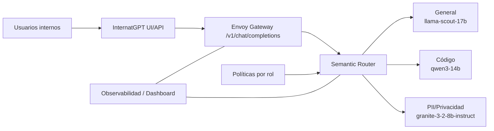
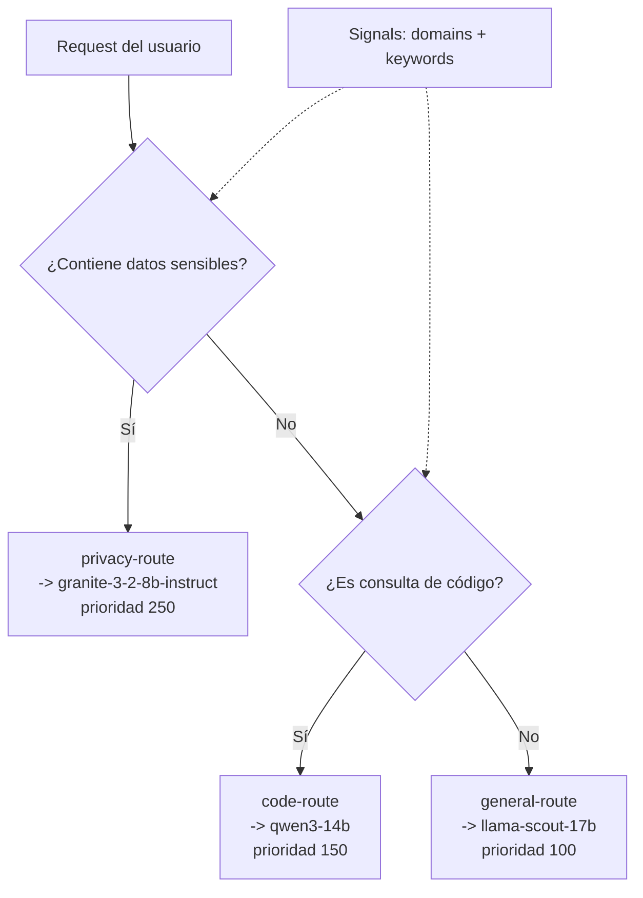
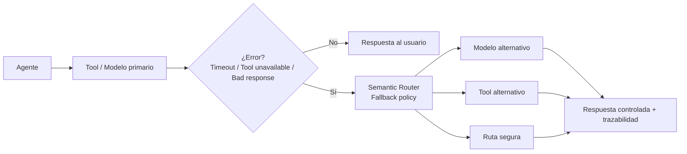

# Talk de 15 minutos — contexto + demo + diagramas

Este guion está pensado para una audiencia técnica/arquitectura.

## Objetivo de la charla

Explicar por qué un cliente con **InternatGPT en OpenShift AI** necesita routing inteligente entre modelos, control por rol y fallback confiable para agentes.

---

## Agenda (15 min)

1. Problema de negocio y contexto (3 min)  
2. Arquitectura propuesta (3 min)  
3. Cómo decide el router (3 min)  
4. Agentes, tools y manejo de errores (3 min)  
5. Cierre + transición a demo live (3 min)

---

## 1) Historia / contexto (3 min)

### Narrativa sugerida

"Nuestro cliente implementó un **InternatGPT** interno sobre OpenShift AI.  
Al principio tenía pocos modelos, pero rápidamente creció: modelos generales, de código, de privacidad y agentes con herramientas.

El problema ya no era 'tener modelos', sino **asegurar que cada petición llegue al modelo correcto**.

Además, cada rol ve capacidades distintas. Un equipo de desarrollo puede usar ciertos modelos y tools que otros usuarios no deberían usar.

Y ahora, con agentes, aparece otro desafío: cuando falla una tool o un modelo, no podemos devolver error sin más; necesitamos **re-enrutamiento controlado**, trazable y seguro."

### Mensaje clave

- Más modelos sin routing = más riesgo.
- Routing semántico + políticas = control operacional.

---

## 2) Arquitectura (3 min)

### Diagrama 1 — Arquitectura InternatGPT

### Cómo explicarlo

- Envoy es la entrada de chat.
- Semantic Router decide modelo destino.
- Políticas por rol condicionan acceso/capacidades.
- Dashboard da trazabilidad de decisiones.

---

## 3) Lógica de decisión (3 min)

### Diagrama 2 — Flujo de routing

### Puntos para remarcar

- La clasificación usa señales (`domains`, `keywords`).
- La prioridad resuelve conflictos.
- El objetivo no es solo "responder", sino responder con el modelo adecuado.

---

## 4) Agentes, tools y fallback (3 min)

### Diagrama 3 — Manejo de errores en agentes

### Mensaje clave

- No se pierde la petición: se re-enruta.
- El fallback debe ser explícito, observable y gobernado.

---

## 5) Transición a la demo live (3 min)

### Script sugerido

"Con esto en mente, en la demo voy a mostrar tres cosas:
1) cómo enruta una consulta general,  
2) cómo enruta una de código,  
3) cómo una consulta con PII se desvía a la ruta de privacidad.

Y después veremos un caso ambiguo para comprobar que la prioridad y la política se comportan como esperamos."

### Prompts listos

- General: `What is the capital of France?`
- Code: `Write a Python function to sort a list.`
- Privacy: `My credit card number is 4111-1111-1111-1111.`
- Ambiguo: `Create a Python script to process this SSN 123-45-6789.`

---

## Slide final (takeaway)

**"El valor no es tener más modelos: es orquestarlos con reglas, roles y resiliencia."**

